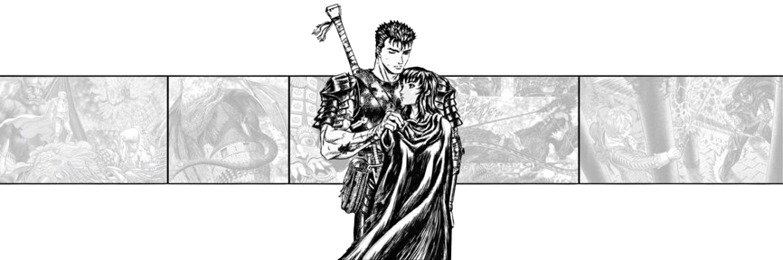

  

<h1 align="center">⚡ ASMAEL ⚡</h1>

  

---
🧠 PERFIL

+ Nombre: Asmael
+ Estado: ACTIVO
+ Rol: Desarrollador Web
+ Enfoque: Sistemas interactivos y diseño futurista
+ Stack: HTML | CSS | JavaScript | C++ | Java | Electron | SQLite

  

<h2 align="center">📡 SYSTEM STATS</h2> 
   
 
  

<h2 align="center">🚀 FEATURED PROJECT // ILUSTRATE</h2> 
  
 
  

<h2 align="center">🔗 CONTACT // SIGNAL LINK</h2> 
   

  
 
  

